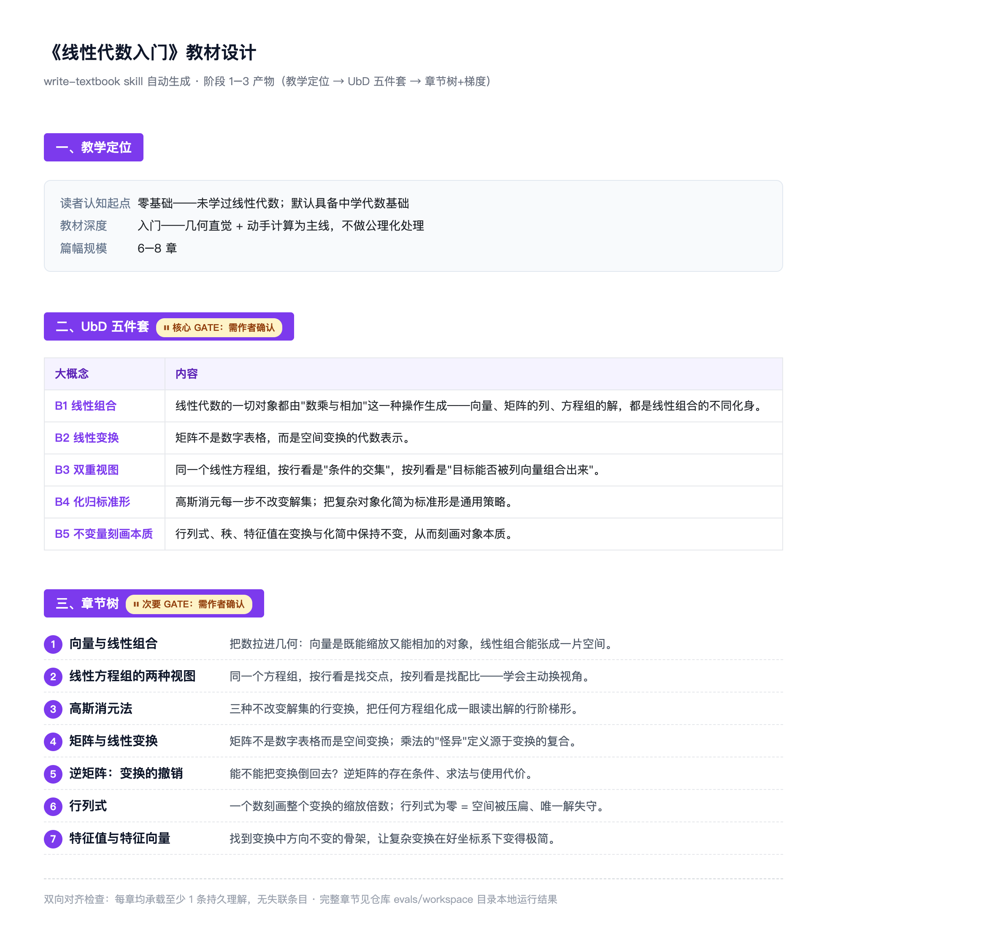
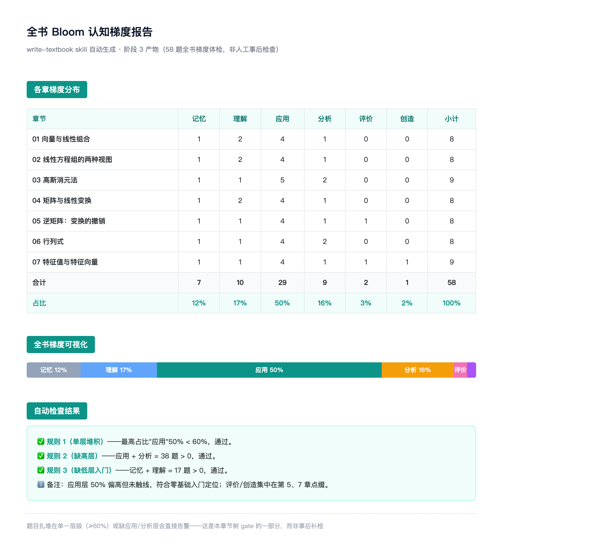
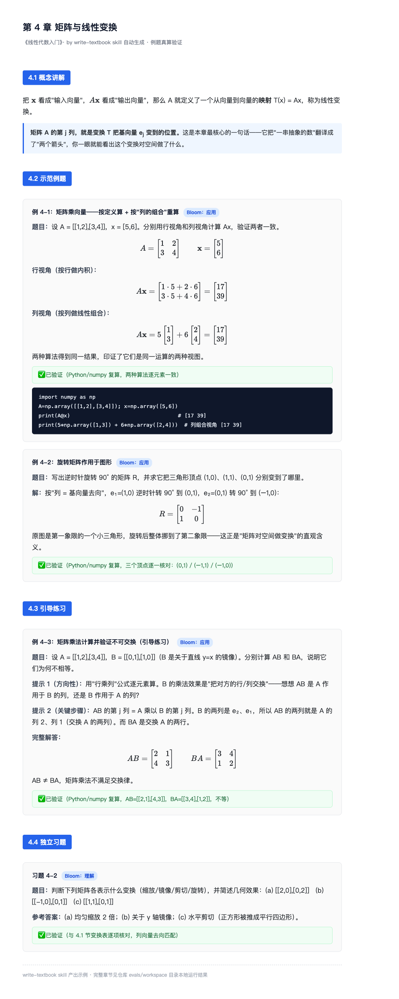

# textbook-writer-skills

[](https://github.com/cabbage2000-lab/textbook-writer-skills/actions/workflows/ci.yml)
[](LICENSE)
[](CHANGELOG.md)

一套给 Claude Code 用的教材写作 skill 组合，面向数学、物理、计算机等「例题可验证」的 STEM 学科。它把成熟的教学设计方法装进 AI 的工作流：先想清楚"学生学完该带走什么"，再倒推章节和习题，一章一章写出有主线、有梯度、例题答案可信的成体系教材——中途断了随时续写。

## 解决什么问题

直接对 AI 说"帮我写一本教材"，通常会踩中三个坑。这套 skill 的全部设计都是冲着它们去的。

### 坑一：写出来的是知识点汇编，不是教材

AI 很乐意一章一章罗列概念，像把百科词条装订成册：没有贯穿全书的主线，习题和"学生该学会什么"对不上，学完不知道该带走什么。

**怎么解决——先设计，后动笔。** 借用教育学的成熟方法「UbD 逆向设计」：动笔前先逼作者回答"学生学完该带走什么"，形成五件套——大概念、持久理解、核心问题、迁移目标、学习目标——作者确认后，才由此倒推章节树和每章的例题/习题计划，和主线对不上的章要砍或改。

下图是同一本《线性代数入门》的阶段 1–3 产物——教学定位、UbD 五件套（大概念）、章节树，两处 gate 停点清晰可见：



**配套的梯度与节奏。** 每道题都标注认知层级（Bloom 六级：记忆→理解→应用→分析→评价→创造），全书自动做梯度检查——题目扎堆在单一层级（≥60%）或缺了应用/分析层会直接告警；每章正文遵循固定的四段式节奏（概念讲解 → 示范例题 → 引导练习 → 独立习题），不会有的章全是概念、有的章全是题。

同一本教材 58 道题的全书梯度体检报告——分布表、可视化条形图、三条自动检查规则：



### 坑二：例题看着头头是道，一算就错

编造答案是 AI 写 STEM 教材最致命的毛病——读者照着例题演算，发现书是错的，整本教材的信誉就没了。

**怎么解决——每道题真算一遍。** 所有计算类例题和习题的答案，必须实际复算核对后才能输出，复算过程随题附上；确实验证不了的（开放讨论、数值实验类），明确标注 `⚠️ 需作者确认`，绝不假装已验证。

下图是 `textbook` 端到端跑出的《线性代数入门》第 4 章片段——四段式节奏（概念讲解→示范例题→引导练习→独立习题）与每道题的真算验证标签清晰可见：



### 坑三：章数一多就写崩

把 10+ 章教材塞进一个对话，上下文迟早爆掉：写到第八章忘了第二章的记号，术语前后不一致；中途断线只能从头再来。

**怎么解决——一章一章独立写，进度落盘。** 每章写作只接收轻量输入：该章大纲切片、全书教学设计（UbD 五件套）、术语表和前章小结——不读任何其他章的正文，章数再多也不会撑爆上下文。写作进度实时写入 `.progress.json`，任何时刻中断，下次一句话就能从断点续写，已完成的章不会被重写。

## 设计理念

- **拼教学设计，不拼长文生成。** 写教材的难点不在写作本身，在教学设计。已有工具解决的是"把素材组织成长文档"，这套 skill 解决的是"怎么把一门知识教明白"。
- **关键决策由作者拍板。** 教学定位、UbD 五件套、章节树是一本教材的灵魂。skill 给出草案后会停在两个检查点（gate）等作者明确确认，任何"流程优化"都不得绕过——它的职责是逼你想清楚，不是替你做主。
- **诚实优先于流畅。** 验证不了的结论宁可标注"需作者确认"，也不输出一个看起来自信的编造结果。
- **用流水线代替一口气写完。** 4 个 skill 各管一段，阶段之间靠书面契约交接，互不读对方的中间过程——这是长教材写得完、每章质量稳定的工程保证。

## 使用场景

适合"自己懂学科、想把知识写成体系化教材"的人：写技术讲义的开发者、把课堂笔记整理成教材的教师和学生、做教学内容的创作者。skill 负责结构和纪律，学科知识的判断仍然在你。

| 你想做什么 | 对 Claude Code 说 |
| ---------- | ----------------- |
| 从零写一整本教材 | `用 textbook 写一本《线性代数入门》教材` |
| 只做教学设计与大纲 | `用 textbook-outline 设计一份数据结构教材大纲` |
| 按已有大纲单写一章（也可写带完整例题的深度技术文章） | `用 textbook-chapter 按大纲写第三章` |
| 只出几道答案经过验证的题 | `用 textbook-exercises 出几道矩阵乘法的练习题` |

v1 明确不覆盖：文科论述题/案例分析（留到 v2）、把已有素材整理成课程、在线课程平台与 LMS 集成、自动生成插图。

## 快速开始

三种安装方式任选其一：

**方式一：作为 plugin 安装**（推荐，可随仓库更新）——在 Claude Code 中执行：

```text
/plugin marketplace add cabbage2000-lab/textbook-writer-skills   # 也可用本地仓库路径
/plugin install textbook-writer@textbook-writer-skills
```

**方式二：复制到个人 skills 目录**（对所有项目生效）：

```bash
cp -r skills/* ~/.claude/skills/
```

**方式三：在本仓库内开发/试跑**——clone 后执行一次，把 `skills/` 软链为项目级 skills 目录（`.claude/` 已 gitignore，不入库）：

```bash
mkdir -p .claude && ln -s ../skills .claude/skills
```

**在 Codex 中使用**——无需额外安装：在 Codex CLI 中打开本仓库目录即可，仓库根的 [AGENTS.md](AGENTS.md) 会自动引导 Codex 找到并遵循对应 skill。例如输入：

```text
写一本《线性代数入门》教材
```

### 第一次运行会发生什么

新开一个 Claude Code 会话，输入：

```text
用 textbook 写一本《线性代数入门》教材
```

1. skill 建立教材项目目录和进度文件 `.progress.json`；
2. 一轮提问确认教学定位：写给谁、多深、多大篇幅；
3. 产出 UbD 五件套，停在 `⏸ 等待确认`——第一个 gate，可确认，也可提修改意见；
4. 确认后产出章节树和全书 Bloom 梯度报告——第二个 gate；
5. 之后逐章写作，每章独立落盘为一个 `.md` 文件，最后通读审核定稿。

中途任何时候中断，重新输入同一句话即可从断点续写。

## 工作原理

1 个主 skill 调度 3 个子 skill，走五阶段流程。4 个 skill 是一个整体组合（跨 skill 以相对路径互相引用），需整体安装：

```text
textbook (主 skill / orchestrator)
  ├─ 职责：驱动五阶段流程、维护 .progress.json 状态、在阶段间传递交接契约
  │
  ├─ textbook-outline (子 skill 1：大纲设计)
  │    └─ 阶段 1-3：教学定位 → UbD 五件套(核心 gate) → 章节树+梯度报告(次要 gate)
  │
  ├─ textbook-chapter (子 skill 2：单章写作)
  │    └─ 阶段 4：按四段式（概念讲解→示范例题→引导练习→独立习题）逐章成文
  │
  └─ textbook-exercises (子 skill 3：例题生成)
       └─ 被单章写作调用：生成三类题并真算验证
```

阶段间交接契约、教材项目落盘布局、`.progress.json` 状态机与重入规则，全部以 [handoff-contract.md](skills/textbook/references/handoff-contract.md) 为全项目唯一权威定义。

仓库布局：

```text
skills/               # 4 个 skill；各自 references/ 存放知识底座（UbD 指南、Bloom 动词表、章节模板、例题验证规范等）
.claude-plugin/       # plugin 与 marketplace 清单，支持 /plugin 安装
evals/                # 行为测试用例：prompt + 客观断言（用例入库，运行产物不入库）
scripts/ + tests/     # 结构校验脚本及其单元测试
```

## 质量保障

三层防线，前两层由 CI 自动执行（[.github/workflows/ci.yml](.github/workflows/ci.yml)）：

```bash
python3 scripts/validate_skills.py       # ① 结构校验：skills 内容 + plugin 清单一致性 + 仓库健康
python3 -m unittest discover -s tests    # ② 单元测试：校验逻辑本身
# ③ 行为测试：evals/evals.json 的 5 个用例真实运行，改动 skill 后按 CONTRIBUTING.md 映射表重跑
```

维护与贡献流程（影响半径、DoD、发版）见 [CONTRIBUTING.md](CONTRIBUTING.md)，版本记录见 [CHANGELOG.md](CHANGELOG.md)。

## 里程碑状态

| 里程碑 | 内容 | 对应 eval 用例 | 状态 |
| -------- | ------ | -------- | ------ |
| M1 | 骨架搭建：4 skill + 6 references + 校验 | — | ✅ 完成（含 3 项行为冒烟测试） |
| M2 | 大纲 skill 用真实学科跑通双 gate | [eval 1](evals/evals.json) | ✅ 通过（5/5 断言，2026-07-14；判定见 evals/workspace/2026-07-14-eval-1/outputs/judgment.md） |
| M3 | 单章 + 例题 skill 跑通 | [eval 2, 3](evals/evals.json) | ✅ 通过（各 5/5 断言，2026-07-14；判定见 evals/workspace/2026-07-14-eval-2/rerun/outputs/judgment.md、2026-07-14-eval-3/outputs/judgment.md） |
| M4 | 主 skill 端到端写完整本教材（含中断续写） | [eval 4](evals/evals.json) | ✅ 通过（5/5 断言，2026-07-14；7 章 58 题全真算验证、中断后续写未重写已完成章；判定见 evals/workspace/2026-07-14-eval-4/outputs/judgment.md） |
| M5 | 第二门学科复跑验收 | [eval 5](evals/evals.json) | ⏳ 待跑 |

## License

[MIT](LICENSE)
